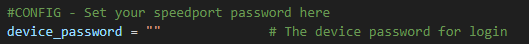
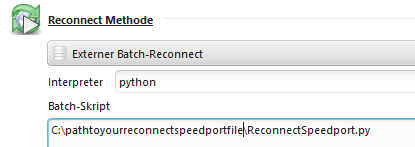

## Instructions

### Step 1: Install Python
Make sure Python 3.x is installed (in my case 3.12.4).

### Step 2: Configure your router password
Change your password under the config section in `ReconnectSpeedport.py`:

### Step 3: Configure JDownloader
- Choose **External Batch-Reconnect**.
- For Interpreter, choose `python`.
- For the Batch-Script, select the path to `ReconnectSpeedport.py`.

### Step 4: Enjoy :)
